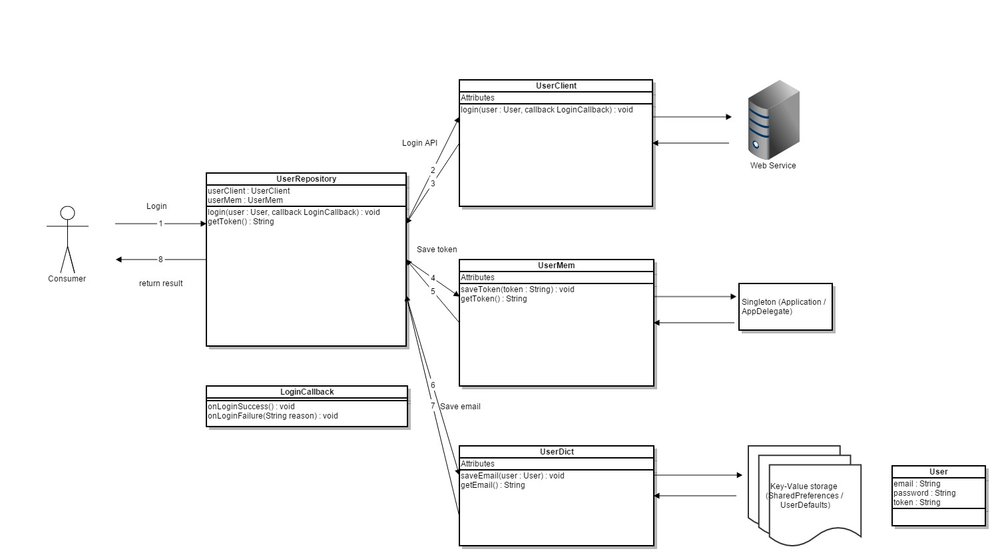
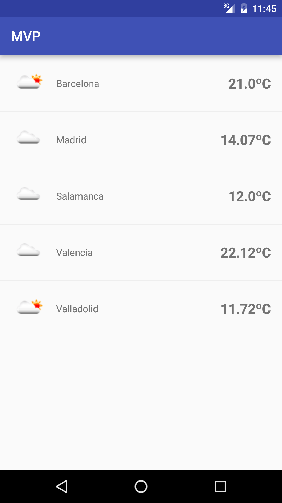

# MVP Android

Description as written by : vAlmaraz
https://github.com/vAlmaraz

The project is a basic example about MVP for Android.
This README will explain as a tutorial how to achieve my personal MVP implementation.

It is based on [Konstantin Mikheev](https://github.com/konmik/konmik.github.io/wiki/Introduction-to-Model-View-Presenter-on-Android) and presentation layer of Clean Architecture example by [Fernando Cejas](https://github.com/android10/Android-CleanArchitecture) examples. It also follows my own [code style guide](https://github.com/vAlmaraz/code-style).

**NOTE**: If you want to compile and run this project, you need to get an api key from [OpenWeatherMap](http://openweathermap.org/api). Sign up and get your api key. Then, change it in [Environment class](app/src/main/java/com/valmaraz/mvp/Environment.java).

## First steps: avoiding massive Activities/Fragments

In order to keep classes as simple as possible and divide responsibilities, you should satisfy these aims:

### Separate adapters and holders in different classes

Don't mix responsibilities and let adapters and holders work separately. 

Example: [MainAdapter](app/src/main/java/com/valmaraz/mvp/view/adapter/MainAdapter.java) and [MainHolder](app/src/main/java/com/valmaraz/mvp/view/holder/MainHolder.java). MainAdapter only knows about its data and what resource file has to load per item. MainHolder only knows about rendering data into its widgets.

### Wrap components

It will help you to globally set options and change each implementation (and also change library if needed).
Example: [Picasso](app/src/main/java/com/valmaraz/mvp/view/component/ImageLoader.java) and [Toast/Snackbar](app/src/main/java/com/valmaraz/mvp/view/component/UIMessage.java). ImageLoader will download a image and set it into a ImageView. It is currently implemented by Picasso library, but it could be easily changed to Fresco, Glide or any other third party library (or your own implementation). UIMessage will show a temporal message in screen. It is currently implemented by Toast but can be replaced by Snackbar if needed.

### Group listeners when possible

Instead of setting a different listener per widget (for example, one OnClickListener per button), group them and switch between ids.
I usually implement OnClickListener interface in Activities or Fragments, in order to have one single onClick method for every click event in the screen.

### Inject view dependencies

Using [ButterKnife](https://github.com/JakeWharton/butterknife) library will help you to avoid a lot of useless lines of code binding each widget with annotations.

## MVP

*Model–view–presenter (MVP) is a derivation of the model–view–controller (MVC) architectural pattern, and is used mostly for building user interfaces.*

*In MVP the presenter assumes the functionality of the "middle-man". In MVP, all presentation logic is pushed to the presenter.*

Source: Wikipedia

This pattern separates source code into three layers (responsibilities):
- Model: Manages data (retrieves or updates it), usually connected with a restful API and/or database.
- View: Receives input and shows result to user.
- Presenter: Provides a view using data from Model layer.

### View and Presenter

View layer is composed by Activies, Fragments, Adapters, Holders, custom Views and layout resources.

Activities and Fragments will implement a custom class, a [BaseView](app/src/main/java/com/valmaraz/mvp/view/BaseView.java) or a child. This class is the link between View layer and Presenter layer, and will declarate methods that a specific view (screen) need to perform (see [MainView](app/src/main/java/com/valmaraz/mvp/view/MainView.java)).

Presenters are objects that manage a BaseView child. They will configure view attending to events sending from View layer (Activities and Fragments). For example, when an Activity is loaded, it will create its presenter. The presenter will request data from Model layer, configure view while data is being downloaded and, once finished, configure view with received data.

Each Activity or Fragment has a reference to a Presenter, and the presenter will manage its own BaseView child.

See [MainActivity](app/src/main/java/com/valmaraz/mvp/view/activity/MainActivity.java) and [MainPresenter](app/src/main/java/com/valmaraz/mvp/presenter/MainPresenter.java) as examples of this behaviour.

### Model

Model layer are a group of classes that defines app domain data. I have implemented the Repository Pattern [more info, in spanish](http://www.valmaraz.com/blog-41-patron-de-repositorios-desarrollo-de-software) to retrieve data from API.

It is based on a class, the Repository, that has the responsibility to retrieve data from Network (API), Database, Disk, SharedPreferences... It should also cache data if needed before returning info.

## Screenshots

